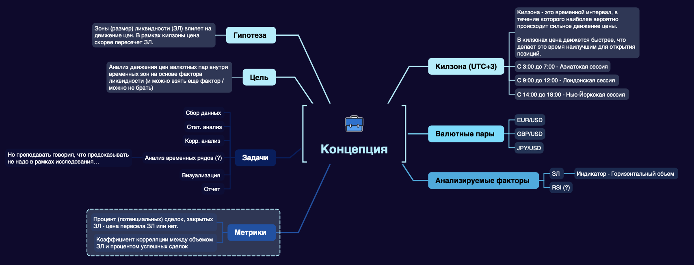
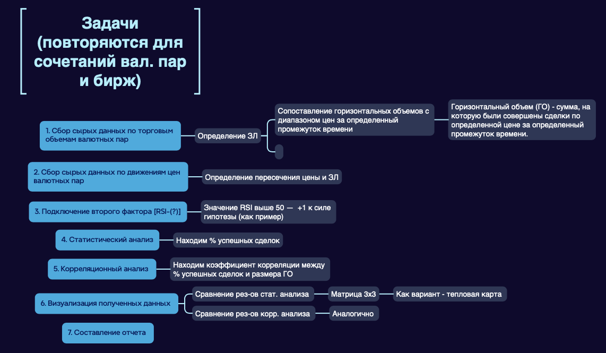

## Итоговый проект по дисциплине финансовая математика и эконометрика. Первый семестр 2023

### Структура проекта: 

1. [обзор литературы](articles_review/README.md)
2. теоретическая постановка
3. практическая реализация
4. отчет (до 10 страниц)
5. презентация (на 10 минут + 5 минут на вопросы)

### Процесс

Материал по каждому из пунктов сдается в свой дедлайн. Результаты каждого этапа вносится в общую <a href='https://docs.google.com/spreadsheets/d/1KS2T6YaCP3QGZjX_VuA5Hfac5_lqEhzLsBHwb-sendw/edit#gid=0'>таблицу</a> в виде ссылки на ресурс.

### Концепция

### Цель
### Анализ движения цен валютных пар (3-4 наиболее ликвидных) внутри временных зон, соответствующих повышению активности на крупных торговых площадках

### Задачи

<ol type="a">
  <li>Сбор сырых данных по ценам и торговым объемам валютных пар на форексе</li>
  <li>Определение целевых временных зон (ЦВЗ) – временные интервалы внутри дня по московскому времени, совпадающие с наибольшей активностью крупнейших мировых валютных торговых площадок</li>
  <li>Анализ движения цены внутри ЦВЗ в различных таймфреймах (5мин, 15мин, 30мин, 60мин, дневной и недельный таймфреймы) – торговые объемы, уровни, точки притяжения цены и т.д.</li>
  <li>Подключение алгоритмов машинного обучения (scikit learn и т.д.) для определения направления движения цены</li>
</ol>

### Структура репозитория

* Папка classes будет содержать все классы для работы
* Класс dfContainer нужен для модификации датасета: переводит строковое значение даты/времени в формат datetime, делает его индексом, добавляет столбец Close (необходим для работы библиотеки mplfinance)
* Методы класса включают:
  - show_info - выводит информацию о датасете
  - show_describe - выводит стат.данные по датасету
  - draw_graph - рисует графики по вводным параметрам

### Участники

<a href='https://t.me/nvolkovsky1'>Волков Никита</a> - ментор

Команда аналитиков:

<a href='https://t.me/Berezhnoy_Sasha'>Бережной Александр</a>

<a href='https://t.me/Gulliver_7774'>Марат Галиулин</a>

<a href='https://t.me/dimitrius2'>Дмитрий Казанский</a>

<a href='https://t.me/baldallerie'>Валерий Лысиков</a>
