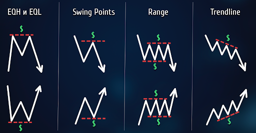
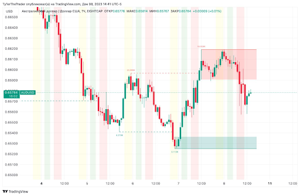

[В начало](../README.md)

> **Печатная форма Отчета** [доступна по ссылке](https://docs.google.com/document/d/1LDdcGKonEZA6_FaC48N1VvpRG3CL7Ef06_JrygggAJU/edit)

>>>>>  gd2md-html alert:  ERRORs: 0; WARNINGs: 1; ALERTS: 3.

<ul style="color: red; font-weight: bold"><li>See top comment block for details on ERRORs and WARNINGs. <li>In the converted Markdown or HTML, search for inline alerts that start with >>>>>  gd2md-html alert:  for specific instances that need correction.</ul>

Links to alert messages:
<a href="#gdcalert1">alert1</a>
<a href="#gdcalert2">alert2</a>
<a href="#gdcalert3">alert3</a>

>>>>> PLEASE check and correct alert issues and delete this message and the inline alerts.

**Федеральное государственное автономное образовательное учреждение высшего образования**

**«Московский физико-технический институт (государственный университет)»**

Направление обучения: Финансовые технологии и аналитика

**ИССЛЕДОВАНИЕ В РАМКАХ ДИСЦИПЛИНЫ ФИНАНСОВАЯ МАТЕМАТИКА И ЭКОНОМЕТРИКА**

**Тема: **«Оценка эффективности совершения сделок внутридневной и междудневной торговли на основании фактора ликвидности и индикатора RSI  на примере торговли валютных пар»

Студенты: 

- Галиулин Марат 
- Лысиков Валерий 
- Бережной Александр 
- Казанский Дмитрий

Москва 2023

[TOC]

# Введение

## **Трейдинг как рыночный феномен и модель осуществления сделок на ФР и ВР**

При упоминании фраз "валютный рынок", "фондовый рынок", "биржа", "Форекс", многим из нас представляются кадры из зарубежных фильмов, где в заполненном зале, усыпанном мониторами с котировками цен, трейдеры толкаются, кричат и машут ордерами на покупку или продажу ценных бумаг. Некоторым на ум приходят биржевые аналитики, изучающие финансовые показатели компании перед приобретением её акций или облигаций, а также составляющие еженедельные обзоры фондового рынка на популярных телевизионных каналах.

На финансовых и валютных рынках существуют два принципиально различных подхода: инвестирование и трейдинг. Инвестирование, базирующееся на фундаментальном анализе (изучение финансовых показателей компании, её выручки, прибыли, дивидендов и т.д.), представляет собой формирование долгосрочного портфеля. С другой стороны, трейдинг — это краткосрочная покупка или продажа активов с целью получения прибыли от ценовых различий.

Сложность фундаментального подхода в формировании инвестиционного портфеля очевидна. Он включает в себя детальный анализ финансовой отчётности компаний, оценку их финансового состояния, анализ других компаний в данном сегменте, а также учёт глобальной и региональной политической обстановки и новостного фона.

Однако, привлекательность кажущейся простоты внутридневной торговли на фондовом и валютном рынках, основанной на принципе "купи дешевле, продай дороже", часто вводит в заблуждение. Популяризация дей-трейдинга в кинематографе, литературе и социальных сетях привлекает огромное количество желающих быстро заработать деньги, часть из которых, к сожалению, сталкивается с финансовыми потерями.

Интерес к внутридневной торговле возможно объяснить интуитивной привлекательностью её концепции. Однако, при более глубоком изучении, оказывается, что внутридневная торговля не менее сложна, чем инвестирование на основе фундаментального анализа.

# Теоретическая часть

## **1. Обзор литературы**

### **1.1. Торговые стратегии.**

Для разработки индивидуальной торговой стратегии трейдер может использовать разнообразные инструменты [1], прежде всего, такие классические методы, как:

* Свечной анализ: включает в себя изучение уровней поддержки и сопротивления, фигур разворота и продолжения тренда, применение волновой теории Эллиота, уровней Фибоначчи и других техник.
* Торговые индикаторы: результат математического анализа ценовых колебаний, объема торгов, общественного сентимента и др. Некоторые из них включают:
* Стохастический осциллятор: определяет перепроданность/перекупленность рынка и может использоваться для обнаружения дивергенций и конвергенций.
* RSI (индекс относительной силы): аналогичен стохастическому осциллятору и может указывать на зоны перекупленности/перепроданности.
* Parabolic SAR (стоп-реверс): служит индикатором уровней поддержки и сопротивления, а также подтверждением для входа в рынок.
* EMA (экспоненциальная скользящая средняя): используется для анализа пересечения скользящих средних и выявления разворотов.
* Линии Боллинджера: строит канал вокруг ценовой динамики и используется для выявления отбоев и начала импульсов.

Также трейдеры могут включать в свои стратегии анализ цены одного актива относительно другого, известного как парный трейдинг. Например, можно рассматривать корреляцию между фьючерсами на нефть марки Brent и курсом рубля к доллару США или движения акций двух компаний из одного сегмента рынка.

Современные технологические тенденции также существенно повлияли на область финансов и торговли. Бурное развитие систем работы с большими данными, алгоритмов машинного обучения и искусственного интеллекта сделали программный доступ к финансовым данным более широким и эффективным [2]. Алгоритмы машинного обучения активно применяются для анализа рыночной информации и автоматизации торговых стратегий.

Наиболее распространенными языками программирования в области алгоритмической торговли являются Python, GoLang, R и Java. Python с его богатой экосистемой библиотек широко используется для анализа данных, машинного обучения и глубокого обучения [3]. GoLang, представляющий собой компилируемый язык, обеспечивает высокую скорость выполнения и эффективность [4]. R служит основным инструментом для статистического анализа и визуализации данных [5]. Java, как строго типизированный язык, нашел применение в высокоэффективных распределенных системах [6].

### **1.2. Ликвидность, как фактор принятия торгового решения.**

Одним из ключевых факторов, оказывающих влияние на поведение цены активов, является ликвидность. Ликвидность рынка относится к способности рынка поглощать торговые операции без значительного влияния на цену актива. Размер ликвидности может существенно влиять на волатильность и стоимость торгуемых инструментов, что делает эту тему актуальной для исследователей и практиков финансовых рынков. 

При изучении влияния ликвидности на баланс цен фундаментальным фактором оказывается макроэкономическая конъюнктура. Так, в своей научной статье [7] Буваев Б.Л. акцентирует внимание на роли институтов финансовых посредников и микроструктуры финансового рынка. Автор формирует гипотезу о зависимости между ликвидностью и макроэкономическими факторами, такими как уровень инфляции, уровень ВВП и уровень процентных ставок в национальной экономике. Т.о. практическое применение гипотезы позволит с большей точностью предсказывать изменения в ликвидности за счет изменения в макроэкономических показателях. Важность этого источника заключается в обозначении многоуровневости воздействия на ликвидность, подчеркивая, что она не является статичным или изолированным явлением​​ и, как следствие, 

Вызывает интерес статья Карповой К.А. [8], в которой младший специалист ММВБ анализирует роль так называемых Dark pools - площадок для проведения непрозрачных сделок на рынке с целью ограничить влияние на ликвидность при совершении крупных сделок.  Однако, это возможность остаться анонимным и минимизировать влияние на волатильность имеет обратную сторону - все больше трейдеров уходят в Dark pools, унося с прозрачного рынка ликвидность, которая так важна для анализа при совершении торговых операций.	       

Исследования, такие как работа Кайла, которая подробно описывается в статье на сайте Investopedia [9], демонстрируют теоретическую связь между ликвидностью и ценой активов, утверждая, что более высокая ликвидность приводит к меньшей волатильности цен. Согласно исследованию, опубликованному в Journal of Financial Economics [10], авторы Амихуд и Мендельсон показали, что инвесторы требуют дополнительную премию за держание активов с низкой ликвидностью, что влияет на ценообразование этих активов. Эти и другие исследования являются основой для понимания взаимосвязи между ликвидностью и ценой на финансовых рынках.

В интернете можно найти множество статей, описывающих стратегии торговли с использованием ликвидности, как с утяжеляющим аргументом в пользу открытия сделки. Так, автор статьи [11] использует понятие “имбаланс” – конструкция из трех свечей, где существует явный дисбаланс между продавцами и покупателями – и объясняет причину его появления снятием ликвидности. Идея в том, что после того, как происходит сбор большого количества стоп лоссов трейдеров, цена резко разворачивается, образуя имбаланс на покупку. Снятие ликвидности заключается в следующем: трейдеры выделяют сильный максимум цены, крупный капитал видит там явное накопление ликвидности, при возврате цены к данному максимуму – цена перебивает данный максимум, но без закрепления телом свечи, тело закрывается ниже, чем перебитый максимум.

Также довольно распространена стратегия [12], основанная на отслеживании зон поддержки (зона с потенциальной силой покупателей)  и сопротивления (зона с потенциальной силой продавца). Прежде чем приступить к торговле и сделкам, трейдеры находят явные скопления (пулы) ликвидности, поскольку это и будет для них ближайшей целью цены. 

	Приведем некоторые типы ликвидности (рис.1):

* Равные максимумы EQH и минимумы EQL
* Структурные точки Swing – значимый High или Low
* Границы в боковом движении цены (Range – флэт, боковик)
* Трендовое движение – ликвидность за трендовой линией

Рис. 1. Типы ликвидности.

Важность результата анализа всех вышеуказанных источников заключается в обозначении многоуровневости воздействия на ликвидность. Подчеркнем, что она не является статичным или изолированным явлением и, как следствие, мы имеем дело с гетероскедастичностью.

## **2 . Теоретические результаты**

### **2.1. Формы и методы анализа влияния факторов**

Когда мы говорим о ценообразовании того или иного актива, важно понимать, какие процессы происходят «под капотом» - какие механизмы и по каким законам двигают цену. Роль описания работы подобных процессов отведена эконометрическим моделям — математические модели, которые используются для анализа экономических данных и отражают количественные зависимости между экономическими переменными.

1. Линейные регрессионные модели:
* Простая линейная регрессия: модель с одной независимой переменной, описывающая прямую зависимость между двумя переменными;
* Множественная линейная регрессия: модель с несколькими независимыми переменными, позволяющая анализировать влияние нескольких факторов на зависимую переменную одновременно.
2. Нелинейные регрессионные модели:
* Полиномиальная регрессия: расширение линейной модели, включающее полиномиальные члены (квадратичные, кубические и т. д.);
* Логистическая регрессия: используется для моделирования вероятности наступления события, обычно для двоичных зависимых переменных.
3. Временные ряды:
* Авторегрессионные модели (AR): модели, в которых текущее значение переменной рассматривается как функция её предыдущих значений;
* Модели скользящего среднего (MA): в этих моделях текущее значение переменной рассматривается как функция прошлых шоков (ошибок).
4. Системы уравнений:
* Одновременные уравнения: модели, в которых несколько уравнений описывают взаимосвязи между переменными, которые могут быть взаимозависимы;
* Панельные данные: модели, которые используют данные, собранные в разные моменты времени по разным объектам.

Модели ценообразования активов являются фундаментальным инструментом в финансовой теории и используются для оценки ожидаемой доходности активов с учетом рисков, связанных с их владением. 

Существует несколько основных моделей ценообразования активов: 

1. Модель оценки капитальных активов (CAPM – Capital Asset Pricing Model): CAPM предполагает, что доходность актива зависит от его систематического риска, который не может быть диверсифицирован и измеряется бета-коэффициентом;
2. Модель оценки всех активов (APT – Arbitrage Pricing Theory): APT предполагает, что доходность актива зависит от нескольких макроэкономических факторов и их чувствительности к этим факторам, выраженной в виде бета-коэффициентов по каждому фактору;
3. Модель определения цены по трехфакторной модели Фамы и Френча (Fama-French Three-Factor Model): эта модель расширяет CAPM, добавляя два фактора к рыночному риску: размер компании и стоимость акций;
4. Четырехфакторная и пятифакторная модели Фамы и Френча: позднее Фама и Френч добавили к своей трехфакторной модели еще два фактора: инвестиционный стиль (CMA – Conservative Minus Aggressive) и прибыльность (RMW – Robust Minus Weak), чтобы еще лучше объяснить различия в доходности портфелей;
5. Модель ценообразования опционов Блэка-Шоулза (Black-Scholes Model): хотя это модель не для активов напрямую, а для опционов на акции, она фундаментальна в оценке производных финансовых инструментов. Формула Блэка-Шоулза позволяет рассчитать теоретическую цену европейского опциона на покупку (или продажу) акций без выплаты дивидендов.
6. GARCH (Generalized AutoRegressive Conditional Heteroskedasticity) модель — это статистическая модель, используемая для анализа временных рядов данных, особенно для финансовых временных рядов, которые часто демонстрируют волатильность со временем.

### **2.2. Постановка цели и описание концепции исследуемого вопроса.**

#### **2.2.1. Обоснование выбора временного интервала для оценивания эффективности совершения сделок на рынке Forex**

Поскольку рынок Forex открыт для совершения сделок 24/5, трейдеры невольно становятся впутанными в бесконечную гонку за процентом. Рано или поздно перед активным трейдером в ряде приоритетных задачах будет стоять вопрос оптимизации рабочего процесса. Эта проблема решается сужением торгового дня до временного промежутка – килл-зоны.

Итак, килл-зона (КЗ) - это временной интервал, в течение которого наиболее вероятно происходит сильное движение цены. Самоценность подобного временного окна - это узнаваемые глазом опытного трейдера паттерны, позволяющие осуществлять сделки с большей уверенностью в их положительном исходе. Такие КЗ можно различать по часам наибольшей активности участников рынка после открытия торгов на биржах главных финансовых центров мира. \
	Указанное время КЗ соответствует часовому поясу UTC-5 (Нью-Йорк).

* С 20:00 до 00:00 - Азиатская сессия;
* С 02:00 до 05:00 - Лондонская сессия (КЗ);
* С 07:00 до 11:00 - Нью-Йоркская сессия (КЗ) - самая торгуемая.

В период с 02:00 до 11:00 доставка цен наиболее эффективна. 

В КЗ цена движется быстрее (рис. 2), что делает это время наилучшим для открытия позиций. Это расписание применимо к рынку Forex. Криптовалюта, например,  не имеет КЗ и двигается внутри дня более хаотично [13].

Рис. 2. Желтая зона – Азия, зеленая – Лондон, красная – Нью-Йорк на примере пары AUD/USD на часовом таймфрейме

#### **2.2.2. Обоснование выбора активов для оценивания эффективности совершения сделок на рынке Forex**

Для аналитической работы в качестве объектов исследование были взяты наиболее ликвидные активы [14] на рынке Forex: валютные пары EUR/USD, USD/JPY, GBP/USD. Пара EUR/USD является самой популярной, так как евро и доллар – самые распространенные валюты, их используют почти во всех странах мира. Доля данной пары составляет 25% всех сделок на бирже. Второй популярной парой на бирже является пара USD/JPY, ее популярность обусловлена большой международной торговлей, японские товары являются конкурентными, поскольку стоимость йены не высока, ее доля 10-15% всех операций на рынке. Что касается пары GBP/USD, то на ее долю приходится 9-13%, что тоже довольно-таки много [15]. 

#### **2.2.3. Обоснование выбора факторов, влияющих на эффективность совершения сделок на рынке Forex**

Анализ вышеуказанной литературы показал, что изучение феномена ликвидности, как фактора, оказывающего влияние на поведение цен активов, изучается с тех пор, как начали свое существование финансовые рынки. Однако предложенная нами тема в рамках исследования не находит должного отклика в существующих источниках, поскольку отличается специфичностью и требует создания уникальной модели.

С учетом этого, в своем исследовании мы поставили цель найти и построить модель, которая бы наглядно показывала зависимость поведения цены актива от размера ликвидности и индикатора RSI.

Размер зоны ликвидности  (РЗЛ) может быть выражен количественным показателем - горизонтальным объемом.

Горизонтальный объем (ГО) – показатель заинтересованности трейдеров в определенном ценовом уровне с учетом всех сделок за выбранный период, т.е. постоянное накопление таких сделок по ряду соответствующих цен.

Индекс Относительной Силы (RSI) – это осциллирующий индикатор, который показывает моменты, когда актив может находиться в состоянии перекупленности или перепроданности.

Показатели индикатора формируются с помощью сравнения ценового маневра за определенный период времени – обычно 14 периодов, – что позволяет индикатору показывать, не стала ли цена необычно низкой или высокой. Таким образом, он может быть использован для определения того, когда текущий тренд заканчивается или когда формируется новый.

**NB:** индикатор RSI - это история, «следы» цены, потому он не может влиять на зависимую переменную, НО нам история и не нужна. Достаточно зафиксировать значение RSI в момент времени, не учитывая историю. То есть баланс покупателей и продавцов в текущий момент - преобладание тех же самых объемов на покупку или продажу.

#### **2.2.4. Формулирование гипотез**

Подводя итоги главы 2 исследования, мы выделили следующие гипотезы:

1. РЗЛ влияет на движение цен. Если актив в рамках КЗ снял ликвидность определенного размера, цена актива придет в зону противоположной ликвидности.
2. Чем выше значение RSI (70) в момент снятия ликвидности, тем скорее цена актива придет в ЗЛ ниже текущей цены и наоборот - чем ниже значение RSI (30), тем скорее цена актива придет в ЗЛ выше текущей цены.
3. Наиболее ликвидная КЗ - Нью-Йоркская.
4. Наиболее доходная пара - EUR/USD.

#### **2.2.5. Обоснование выбора методов практической реализации проекта**

В рамках текущего исследования предлагается выполнить:

1. Статистический анализ

На основе исторических данных найдем процент сделок «успеха», удовлетворяющих условию снятия ликвидности на продажу/покупку и устремлении цены актива в ближайшую зону на продажу/покупку в рамках КЗ.

> Метрика - процент «успеха» в прошлом.

2. Корреляционный анализ

Также проведем корреляционный анализ с целью выявить степень мультиколлинеарности для отделения влияния одной независимой переменной на зависимую переменную от другой и степень гетероскедастичности для «чистоты эксперимента».

На основе исторических данных найдем коэффициент корреляции  между процентом «успеха» и РЗЛ. 

> Метрика - коэффициент корреляции.

3. Регрессионный анализ

Подходящая для целей исследования эконометрическая модель – множественная линейная регрессия, поскольку нам необходимо проанализировать связь между двумя независимыми переменными и одной зависимой переменной. Полученные по итогам анализа результаты будут проверены с помощью модели GARCH. 

На основе результата пунктов 1, 2 обучим модель, предсказывающую процент «успеха». 	

$$ICLN = b_0\ +\ b_1*Liq_{Vol}\ +\ b_2*RSI_{Num}\ +\ b_3*Profit_$ % «успеха». 

* Метрика - процент «успеха» в будущем.

Ввиду специфичности выбранной темы для более глубокого литературного исследования недостаточно данных. Однако результаты данного исследования могут иметь значительные практические последствия для определения стратегий торговли, имеют прикладной характер. Понимание того, как размер ликвидности влияет на цену, может помочь трейдерам лучше оценить риски и возможности, а также способствовать разработке инструментов для снижения системного риска на финансовых рынках.

# Практическая часть 

## **1. Подготовка данных**

Исторические данные для практической реализации взяли из БД брокера Алор. В сыром виде данные представляет собой таблицу содержащую следующие факты:

* Дата 
* 15 мин (таймфрейм)
* Максимальная цена
* Минимальная цена
* Цена открытия
* Цена закрытия
* Рыночный (вертикальный объем)

## **2. Статистический анализ**

Исторические данные не предполагают получение информации о ЗЛ,  поскольку прямо ЗЛ выражены в “стакане” –  структурированном виде лимитных ордеров — ближайших к последней зафиксированной рыночной цене, поровну с каждой стороны. Т.о, ЗЛ в виде “стакана” представляет собой индикатор настроений участников рынка в _режиме реального времени_. 

Для решения проблемы видения ЗЛ в ретроспективе предложено поделить цену актива на равные диапазоны цен и просуммировать рыночный объем по свечкам, пропорционально входящим в этот диапазон. Т.о мы масштабируем ГО по имеющимся историческим данным, т.е по вертикальному объему и, как следствие, получаем апроксимальные значения РЗЛ. 

Тогда условием “успеха” будет считаться наличие накопления необходимого ГО в соответствующей ЗЛ для входа в сделку и касания противоположной границы ЗЛ в случае накопления необходимого ГО для выхода из сделки.  

	Процент “успеха” будет найден отношением количества сделок, удовлетворяющих условию к количеству анализируемых дней.

Также найдем процент успешных сделок, когда индикатор RSI сигнализировал о том, что актив находился в зоне перекупленности (>70) или перепроданности (&lt;30) 

## **3. Корреляционный анализ**

Проверим наличие/отсутствие между переменными линейной взаимосвязи. Для этого составим корреляционную матрицу (табл. ). Также корреляционный анализ является важным эконометрическим инструментарием, так как позволяет выявить взаимосвязи между переменными и сделать предварительные выводы по выдвинутым гипотезам.

При построении корреляционной матрицы была выдвинута гипотеза, что РЗЛ влияет на .

&lt;В целом, корреляция между всеми переменными в пределах нормы, следовательно, в модели отсутствует проблема мультиколлинеарности, и нет необходимости удаления какого-либо из регрессоров.>

Отметим, что в модели присутствует проблема гетероскедастичности, что достаточно характерно для исследований финансовых рынков при рассмотрении длительного временного интервала.

## **4. Построение модели**

# Заключение

# **Список литературы.**

| N | Источники |
|:--:|:---|
| 1 | [Francber: ТОП 14 самых выгодных индикаторов для трейдинга](https://francber.com/luchshie-indikatory-dlya-trejdinga.html) |
| 2 | Хилпиш И. - Python для финансовых расчетов, 2021 |
| 3 | Хилпиш И. - Python for Algorithmic Trading, 2021 |
| 4 | [Почему Go актуален в современной разработке и зачем его изучать](https://practicum.yandex.ru/blog/zachem-uchit-yazyk-go/">https://practicum.yandex.ru/blog/zachem-uchit-yazyk-go/)|
| 5 | [Язык программирования R: что делает его таким важным для анализа данных](https://practicum.yandex.ru/blog/chto-takoe-yazyk-r/">https://practicum.yandex.ru/blog/chto-takoe-yazyk-r/)|
| 6 | Sekhar V. - Building Trading Bots with Java, 2016 |
| 7 | Буваев Б. - Макроэкономические факторы ликвидности, 2017 |
| 8 | Карпова К. - Темные пулы ликвидности на мировых финансовых рынках, 2015 |
| 9 | Investopedia. "Understanding Liquidity Risk." Investopedia, 2021 |
| 10 | Amihud, Y., Mendelson, H. "Asset Pricing and the Bid-Ask Spread." Journal of Financial Economics, Vol. 17, No. 2, 1986, pp. 223-249 |
| 11 | [Имбаланс в трейдинге по стратегии Smart Money Concept. Как найти на графике FVG](https://dzen.ru/a/ZBHDl14HahZLJfyq">https://dzen.ru/a/ZBHDl14HahZLJfyq) |
| 12 | [Зоны ликвидности на рынке. Уровни поддержки и сопротивления](https://clck.ru/36zuLS) |
| 13 | [Накачанные объемы торгов криптовалютных бирж как индикатор недоверия к криптоиндустрии](https://bits.media/nakachannye-obemy-torgov-kriptovalyutnykh-birzh-kak-indikator-nedoveriya-k-kriptoindustrii/) |
| 14 | Сухих И. -  Значение ликвидности ны рынке Forex, 2018 |

